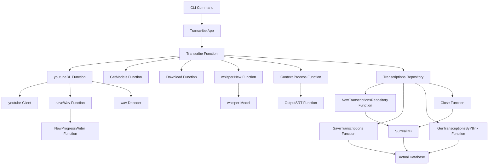

# Whispering into the Future

## Overview:
This workshop will focus on transcribing YouTube videos using the Go programming language utilizing a series of packages like "whisper" for automatic speech recognition, "youtube" for handling YouTube APIs, "cli" for creating command-line applications, and SurrealDB for database interactions.

## Outline:

1. Introduction
    - Brief introduction to transcription
    - Requirements and prerequisites
    - Overview of the packages used in the given code

2. Setup
    - Installing Go and setting up the environment
    - Initializing the project

3. Understanding the Code

   3.1. Repository and Models
        - Implementing the TranscriptionsRepository
            a. Connecting to SurrealDB in the NewTranscriptionsRepository function
            b. Closing the database connection
            c. Saving transcriptions to the database
            d. Fetching transcriptions from the database using the YouTube link
        - Defining the Transcription and Transcriptions models and their methods

   3.2. Imports and Constants
        - Importing required packages
        - Constants used in the code such as port, database configurations, and model names

   3.3. Main Function
        - Creating a context
        - Running the "transcribe_app" function with the created context
        - Error handling

   3.4. Creating the CLI Application
        - Setting up the application with a name, usage, and commands
        - Transcription commands:
            a. Get transcriptions by YouTube link
            b. Transcribe a single YouTube link

   3.5. ProgressWriter
        - Understanding the ProgressWriter struct
        - Creating a NewProgressWriter function
        - Writing with progress tracking

   3.6. Downloading YouTube Audio and Converting to WAV
        - Extracting video details using youtube.Client{}
        - Saving the WAV file

   3.7. Transcription Process
        - Loading the model
        - Creating a processing context with whisper.NewContext()
        - Decoding the WAV file using decodePCMBuffer()
        - Performing the transcription using context.Process()
        - Outputting the results

4. Hands-On Exercise
    - Build the given code
    - Run the application to transcribe a YouTube video

5. Recap and Conclusion
    - Recap of the concepts learned
    - Potential use-cases and applications
    - Future improvements and customizations

6. Q&A Session

## Details

1. Introduction

In this workshop, we're going to learn how to transcribe YouTube videos using the Go programming language. Transcription is the process of converting spoken language into written text. This can be helpful in generating captions, scripts, or even analyzing spoken content in videos. We'll be using several packages to accomplish our goal, including:

    - "whisper" for automatic speech recognition
    - "youtube" for handling YouTube APIs
    - "cli" for building command-line applications in Go
    - "surrealdb" for managing our transcriptions in a database

2. Setup

Before beginning the workshop, make sure that you have Go installed and set up on your machine. Initialize your Go project and import the necessary packages mentioned above. You can find more information on how to set up your Go environment and install packages in the Go documentation: https://golang.org/doc/

3. Understanding the Code

Now let's take a closer look at the different parts of our codebase.

3.1. Repository and Models

Our code includes a custom-built repository that handles interactions with the SurrealDB database service. The "repository" package consists of the "TranscriptionsRepository" struct and its methods.

- Connecting to SurrealDB: In the "NewTranscriptionsRepository" function, we connect to the SurrealDB database by initializing a new "surreal.DB" instance and signing in with our provided credentials. We then use the selected namespace and database.

- Closing the database connection: The "Close" method closes the active database connection.

- Saving transcriptions to the database: The "SaveTranscriptions" method takes a YouTube link and a slice of "Transcriptions" models as input, then saves them to the database using "r.db.Create()".

- Fetching transcriptions from the database using the YouTube link: The "GerTranscriptionsByYtlink" method takes a YouTube link as input and queries the database for matching transcriptions using "r.db.Query()".

In the "models" package, we define our "Transcription" and "Transcriptions" models:

- "Transcription" represents a single transcription entry, including index, text, start time, and end time.

- "Transcriptions" is a slice of "Transcription" models. It has a method called "ToMap()" which converts each "Transcription" into a `map[string]interface{}` for easier interaction with the database.

3.2 - 3.7: These sections cover the main processing flow of the transcription application, from importing required packages and creating a CLI application, to handling YouTube audio downloading and processing, to carrying out the transcription process using the "whisper" package. The code also demonstrates how to output the transcription results and interact with the repository package.

4. Hands-On Exercise

In this part of the workshop, you'll be building the code and running the application to transcribe a YouTube video. Make sure you have set up your environment, imported the necessary packages, and initialized your project correctly. Then, you can build the application using the `go build` command and run it with a sample YouTube video link.

5. Recap and Conclusion

We have learned how to build a transcription application using Go, various packages, and the SurrealDB database service. The workshop covered connecting to and managing the database, creating a custom repository, structuring models, and implementing the transcription process. With this knowledge, developers can create similar applications or expand the application further to support other transcription services or customizations.

6. Q&A Session

Finally, you can engage workshop attendees in a Q&A session to address:

    - any questions they may have
    - challenges they experienced during the hands-on exercise
    - potential use-cases and applications they can see for the knowledge gained
    - suggestions for future improvements and customizations to the application

This Q&A session helps solidify their understanding of the material and provides practical advice for applying the concepts learned in the workshop.

## Architecture Diagram

## Architecture diagram




## Important snippets

Here are some important code snippets from the given codebase:

1. Connecting to SurrealDB and creating a new TranscriptionsRepository

```go
func NewTranscriptionsRepository(address, user, password, namespace, database string) (*TranscriptionsRepository, error) {
    // surreal.New is
    db, err := surreal.New(address)
    if err != nil {
        return nil, fmt.Errorf("failed to connect to database: %s", err)
    }
    _, err = db.Signin(map[string]interface{}{
        "user": user,
        "pass": password,
    })
    if err != nil {
        return nil, fmt.Errorf("failed to sign in: %w", err)
    }

    _, err = db.Use(namespace, database)
    if err != nil {
        return nil, err
    }

    return &TranscriptionsRepository{db}, nil
}
```

2. Saving transcriptions to the database

```go
func (r TranscriptionsRepository) SaveTranscriptions(ytlink string, transcriptions models.Transcriptions) (interface{}, error) {
    fmt.Println("saving transcriptions %v", transcriptions)
    return r.db.Create("transcriptions", map[string]interface{}{
        "ytlink":         ytlink,
        "transcriptions": transcriptions.ToMap(),
    })
}
```

3. Fetching transcriptions for a YouTube link from the database

```go
func (r TranscriptionsRepository) GerTranscriptionsByYtlink(ytlink string) (interface{}, error) {
    return r.db.Query("SELECT * FROM transcriptions WHERE ytlink = $ytlink limit 1", map[string]interface{}{
        "ytlink": ytlink,
    })
}
```

4. Converting audio to WAV format

```go
cmd := exec.Command("ffmpeg", "-i", "pipe:0",
    "-vn", "-ac", "1", "-ar", "16000", "-codec:a", "pcm_s16le", "-f", "wav", "pipe:1")
cmd.Stdin = audioReader

// Write the converted audio to the output file with progress tracking
cmd.Stdout = progressWriter
cmd.Stderr = os.Stderr
err = cmd.Run()
```

5. Decoding the WAV file

```go
func decodePCMBuffer(audioFilename string, data []float32) ([]float32, error) {
    fh, err := os.Open(fmt.Sprintf("/data/%s", audioFilename))

    if err != nil {
        return nil, err
    }
    defer fh.Close()
    dec := wav.NewDecoder(fh)
    if buf, err := dec.FullPCMBuffer(); err != nil {
        return nil, err
    } else if dec.SampleRate != whisper.SampleRate {
        return nil, fmt.Errorf("unsupported sample rate: %d", dec.SampleRate)
    } else if dec.NumChans != 1 {
        return nil, fmt.Errorf("unsupported number of channels: %d", dec.NumChans)
    } else {
        data = buf.AsFloat32Buffer().Data
    }
    return data, nil
}
```

6. Performing the transcription 

```go
if err := context.Process(data, cb); err != nil {
    return err
}
```

These snippets cover the key aspects of the transcription process, database interactions using SurrealDB, and YouTube audio handling.


Here are the important code snippets related to the CLI (Command Line Interface) application in the given codebase:

1. Initializing the CLI application

```go
func transcribe_app(ctx context.Context) *cli.App {
    repository, err := repository.NewTranscriptionsRepository(dbUrl, "root", "root", namespace, database)
    // Error handling and connection setup...
    
    return &cli.App{
		Name:  "ytrans",
		Usage: "Transcribe YouTube videos",
		Commands: []*cli.Command{
			// Add commands for the CLI
		},
	}
}
```

2. Creating the 'get' command for fetching existing transcriptions by YouTube link

```go
{
	Name:  "get",
	Usage: "Get transcriptions by ytlink",
	Action: func(c *cli.Context) error {
		ytLink := c.Args().First()
		if ytLink == "" {
			return fmt.Errorf("please provide a YouTube link")
		}
		transcriptions, err := repository.GerTranscriptionsByYtlink(ytLink)
		// Error handling and printing transcriptions...
		
		return nil
	},
}
```

3. Creating the 'link' command for transcribing a specified YouTube link

```go
{
	Name:  "link",
	Usage: "Transcribe a single YouTube link",
	Action: func(c *cli.Context) error {
		ytLink := c.Args().First()
		if ytLink == "" {
			return fmt.Errorf("please provide a YouTube link")
		}
		err := transcribe(ctx, ytLink, repository)
		// Error handling and running the transcribe function...
		
		return nil
	},
}
```

These highlighted snippets showcase the creation and usage of the CLI application with the 'get' and 'link' commands to handle transcriptions in the given codebase.


To highlight the process of downloading YouTube audio streams and converting them to a WAV file, the following code snippet is important:

```go
func saveWav(ytLink, youtubeID string) (string, error) {
    // Initialize a YouTube client
    client := youtube.Client{}

    // Extract video details
    video, err := client.GetVideo(ytLink)
    if err != nil {
        return "", fmt.Errorf("failed to get video details: %w", err)
    }

    // Find the audio streams
    audioStream := video.Formats.FindByItag(251) // itag 251 is high quality opus audio

    // Download the audio streams
    audioReader, _, err := client.GetStream(video, audioStream)
    if err != nil {
        return "", fmt.Errorf("failed to get audio stream: %w", err)
    }

    log.Println("Successfully downloaded the audio stream")

    outputFilename := fmt.Sprintf("%s_corrupted.wav", youtubeID)
    // Initialize the output wav file
    outputFile, err := os.Create(fmt.Sprintf("/data/%s", outputFilename))
    if err != nil {
        return "", fmt.Errorf("failed to create output file: %w", err)
    }
    defer outputFile.Close()
    log.Println("Successfully created the output file")
    audioSize := audioStream.ContentLength
    progressWriter := NewProgressWriter(outputFile, audioSize, func(written int64, progressPercentage float64) {
        fmt.Printf("Written %d bytes (%.2f%%)\n", written, progressPercentage)
    })

    // Use ffmpeg to convert the audio to wav format + resample for whisper
    cmd := exec.Command("ffmpeg", "-i", "pipe:0",
        "-vn", "-ac", "1", "-ar", "16000", "-codec:a", "pcm_s16le", "-f", "wav", "pipe:1")
    cmd.Stdin = audioReader

    // Write the converted audio to the output file with progress tracking
    cmd.Stdout = progressWriter
    cmd.Stderr = os.Stderr
    err = cmd.Run()

    if err != nil {
        return "", fmt.Errorf("ffmpeg conversion failed: %w", err)
    }

    return outputFilename, nil
}
```


## Dockerfile: installing depedencies inside our container

1. Use the official Golang base image

```Dockerfile
FROM golang:1.19
```

This line specifies the base image to be used for the container — golang:1.19. This image includes the Go programming language version 1.19.

2. Set the working directory inside the container

```Dockerfile
WORKDIR /app
```

This command sets the working directory inside the container to `/app`.

3. Install whisper

```Dockerfile
RUN git clone https://github.com/ggerganov/whisper.cpp.git &&\
    cd whisper.cpp && make &&\
    make libwhisper.so libwhisper.a &&\
    cp whisper.h /usr/local/include &&\
    cp ggml.h /usr/local/include &&\
    cp libwhisper.a /usr/local/lib &&\
    cp libwhisper.so /usr/local/lib &&\
    cd ..
```

This part clones the whisper.cpp repository using the provided GitHub URL and compiles and installs the whisper library. After compiling the library, the necessary files are copied to the appropriate directories.

4. Copy go.mod and go.sum files to the working directory

```Dockerfile
COPY go.mod go.sum ./
```

This command copies the `go.mod` and `go.sum` files from your local machine to the `/app` working directory inside the container.

5. Download all necessary dependencies

```Dockerfile
RUN go mod download
```

This command downloads all the dependencies specified in the `go.mod` file.

6. Copy the source code to the working directory

```Dockerfile
COPY . .
```

This line copies all the source code files from your local machine into the `/app` working directory inside the container.

7. Build the Go app

```Dockerfile
RUN go build -o ytrans
```

This command compiles your Go application, generating an executable binary named `ytrans`.

8. Install 'ffmpeg'

```Dockerfile
RUN apt-get update && apt-get install -y ffmpeg
```

This line updates the package list and installs the 'ffmpeg' package, which is used for audio file conversion.

9. Check if `ggml-tiny.en.bin` exists in the `/app` directory

```Dockerfile
RUN ls -la /app/ggml-tiny.en.bin
```

This line lists the details of the file `ggml-tiny.en.bin` to check if it exists within the `/app` directory.

10. Execute CLI help to test if everything is working correctly

```Dockerfile
RUN ./ytrans -h
```

This line runs the Go application with the `-h` flag to display the help menu. If this command executes successfully, it indicates that the application and all its dependencies have been set up properly.

11. Set the entry point for the container

```Dockerfile
ENTRYPOINT ["/app/ytrans"]
```


### Docker part 2: running database and network

Here's a breakdown of the three Docker commands for the workshop and an explanation of the network part.

1. Building the Docker Container Image

```bash
docker buildx build --platform linux/amd64 -t ytrans-amd64 --load -f Dockerfile .
```

In this command, you are using `docker buildx` to create a Docker container image for the `linux/amd64` platform. The `-t ytrans-amd64` flag is used to specify the image's name (`ytrans-amd64`). The `--load` flag instructs Docker to load the built image into the local Docker instance rather than pushing it to a remote registry. The `-f Dockerfile` flag specifies the Dockerfile that should be used.

2. Running the SurrealDB Container

```bash
docker run --name surrealdb --network surrealdb-network --restart always -v "$(pwd)/data:/data" -p 8000:8000 surrealdb/surrealdb:latest  start --user root --pass root
```

In this command, you're running a SurrealDB container. The `--name surrealdb` flag assigns the name `surrealdb` to the container. The `--network surrealdb-network` flag connects the container to the `surrealdb-network`, which is a user-defined bridge network that allows containers in the network to communicate with each other. The `--restart always` flag ensures that the container restarts automatically if it crashes or the host machine reboots. The `-v "$(pwd)/data:/data"` flag creates a volume mapping the local `data` directory to the `/data` directory inside the container. The `-p 8000:8000` flag maps port 8000 on the host to port 8000 in the container. Lastly, you are using the `surrealdb/surrealdb:latest` image and starting it with the `root` user and password.

3. Running the ytrans-amd64 Container

```bash
docker run --platform linux/amd64 -v "$(pwd)":/data --network surrealdb-network -it --rm ytrans-amd64 link "https://www.youtube.com/watch?v=JzPfMbG1vrE"
```

In this command, you're running the `ytrans-amd64` container built earlier in the workshop. The `--platform linux/amd64` flag specifies that the container should be run on the `linux/amd64` platform. The `-v "$(pwd)":/data` flag maps the current working directory to the `/data` directory inside the container. The `--network surrealdb-network` flag connects the container to the same user-defined bridge network (`surrealdb-network`) we used for the SurrealDB container. This enables communication between the two containers. The `-it` flag ensures that the container runs interactively, attaching your terminal to the container's standard input and output. The `--rm` flag removes the container after it exits to clean up unused resources. Lastly, you are passing a YouTube link to the container to be transcribed.

The network part of these commands is particularly important because it allows the `ytrans-amd64` container to communicate with the `surrealdb` container. By connecting both containers to the same user-defined bridge network (`surrealdb-network`), they can seamlessly exchange data with each other while maintaining isolation from external network traffic.
